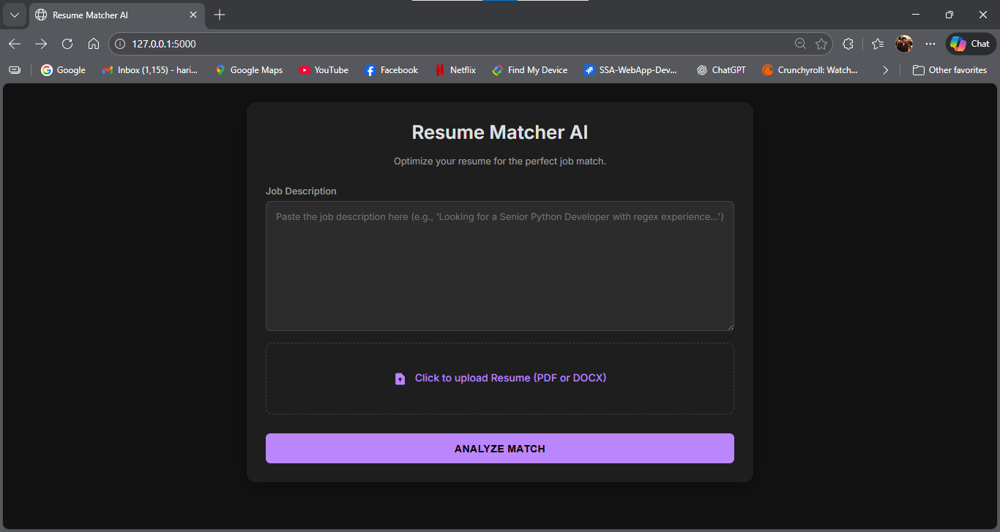
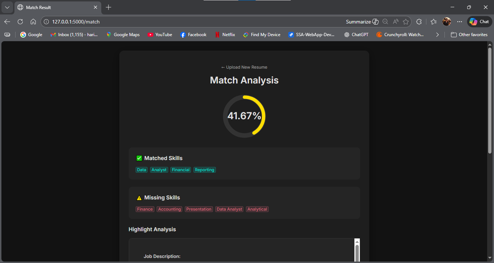

# 🧠 Resume Matcher AI

A powerful, modern **Resume vs Job Description Matcher** web application. It analyzes resumes (PDF/DOCX) against job descriptions to identify key skills, calculating a weighted **match score** based on the frequency of skills in the job description.

## 🚀 Features

- **� Multi-Format Support:** Upload **PDF** or **DOCX** resumes.
- **✨ Smart Skill Extraction:**
    - Correctly identifies technical terms like **C++**, **C#**, **.NET**, **Node.js** (doesn't strip special chars).
    - Uses **Spacy** and a custom PhraseMatcher for high accuracy.
- **🎨 Premium UI/UX:**
    - Space-grade **Dark Mode** design.
    - **Interactive Score Gauge** for instant visual feedback.
    - **Matched vs Missing** skills displayed as clear tags.
    - Drag-and-drop style file upload.
- **📊 Weighted Scoring:** The score isn't just a count; it weights skills based on how often they appear in the job description (signaling importance).

---

## 🛠️ Tech Stack

- **Backend:** [Python](https://www.python.org/), [Flask](https://flask.palletsprojects.com/)
- **NLP:** [spaCy](https://spacy.io/)
- **PDF Processing:** [pdfminer.six](https://pdfminersix.readthedocs.io/)
- **DOCX Processing:** [docx2txt](https://pypi.org/project/docx2txt/)
- **Matching:** [FuzzyWuzzy](https://github.com/seatgeek/fuzzywuzzy) (for fuzzy logic), Custom Regex & Spacy PhraseMatcher

---

## 📸 Screenshots

| Modern Home Page | Analysis Results |
|-------------------|--------------|
|  |  |
*(Note: Screenshots in the `screenshot` folder may need to be updated to reflect the new UI)*

---

## ⚙️ How to Run

### 1. Clone the repository
```bash
git clone https://github.com/yourusername/resume-matcher.git
cd resume-matcher
```

### 2. Create a virtual environment
```bash
python -m venv .venv
source .venv/bin/activate   # On Windows: .venv\Scripts\activate
```

### 3. Install dependencies
```bash
pip install -r requirements.txt
```

### 4. Download spacy model
```bash
python -m spacy download en_core_web_sm
```

### 5. Run the app
```bash
python app.py
```

### 6. Visit the browser
Open **[http://127.0.0.1:5000/](http://127.0.0.1:5000/)**

---

## 📂 Project Structure

```
resume-matcher/
│
├── app.py                  # Main Flask application
├── utils.py                # Core logic (PDF extraction, text cleaning, matching)
├── requirements.txt        # Dependencies
├── skills.csv              # Database of skills to match against
├── templates/
│   ├── index.html          # Modern Upload Page
│   └── result.html         # Premium Results Page
├── static/
│   └── style.css           # Dark mode CSS variables and styles
└── README.md
```

## � Customization
You can update the known skills list by editing **`skills.csv`**. The app loads this CSV on startup to build its NLP patterns.

## 🤝 Contributing
Contributions are welcome! Feel free to fork and submit a PR.
